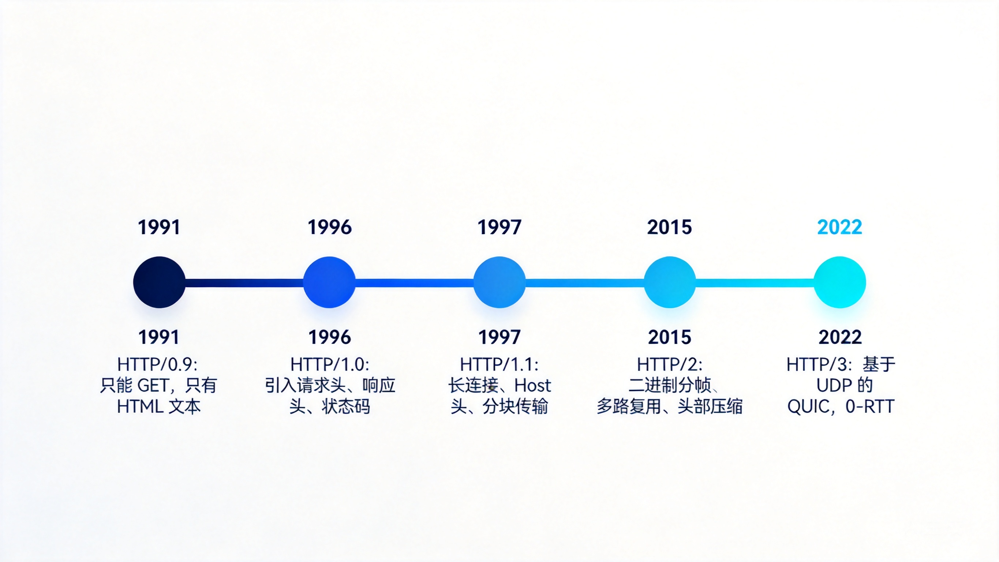
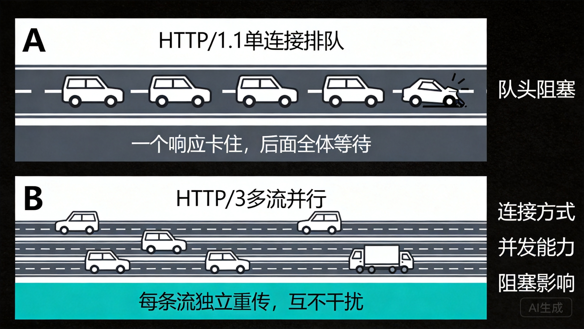
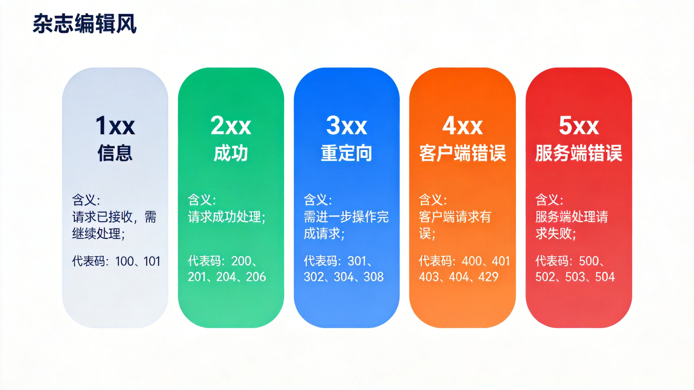
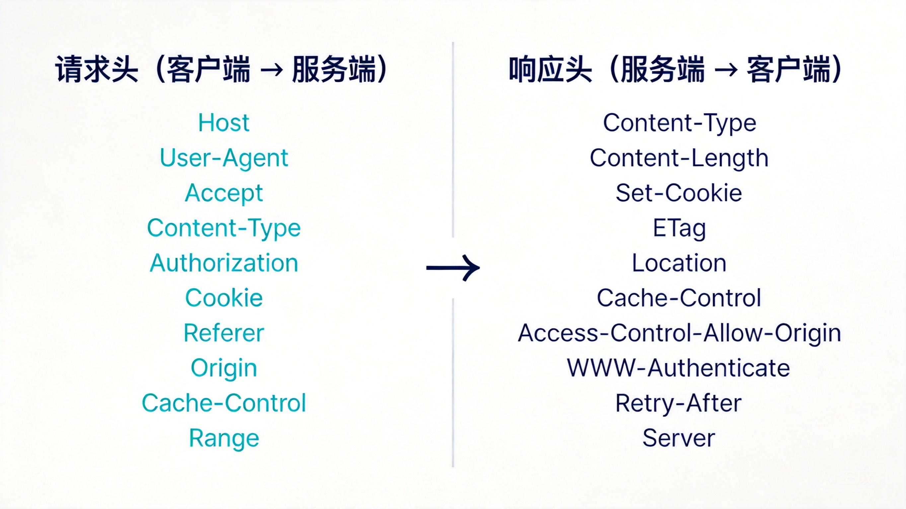
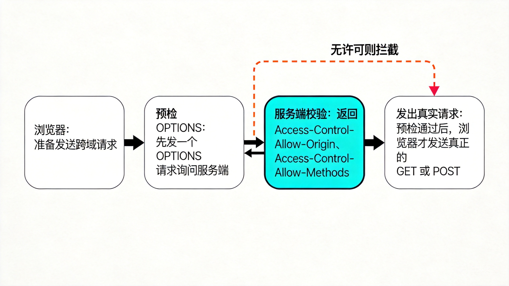

# HTTP 的前世今生：状态码与请求头一次讲透

> 摘要：写了十几年接口，HTTP 却只停留在"会用"层面？这篇文章把 HTTP 五代演进、状态码体系、高频请求头与响应头一次梳理清楚。每一块都从"它解决什么问题"出发，读完你能独立解释版本更迭的动机、状态码的分类逻辑，以及常见 Header 在链路里到底干了什么。

你调过后端，写过接口，抓过包。

但让你从 HTTP/0.9 讲到 HTTP/3，把 301 和 302 的差别、401 和 403 的边界、502 和 504 的责任方讲清楚——很多人会卡壳。

这不是能力问题，是没人逼你系统捋一遍。

今天就捋一遍。目标很明确：**下次再有人问"这个接口为什么返回 304"，你能脱口而出整条链路**。

---

## 先说清楚：这文解决什么问题

三件事：

1. HTTP 五代，每一代到底解决了上一代的什么痛点。
2. 状态码那一串数字，是谁定义的、怎么记、每类什么含义。
3. 请求头和响应头的高频成员，各自在链路里干了什么。

不堆术语。每个概念都落到"它解决什么问题"。

---

## Step 1：五代 HTTP，各修了谁的坑

HTTP 的本质一直没变：**客户端发请求，服务端回响应，中间不保存状态**。

变的是传输效率。记住一句话就够了：

> 每一代，都在解决"更快的连接 + 更小的开销 + 更强的复用"。



### HTTP/0.9（1991）：能用，但只能用一次

只有一个 `GET`，只能返回 HTML 文本，没有请求头、没有状态码、没有 Content-Type。

它的使命就是"把文档传过来"。极简到极致，也脆弱到极致。

### HTTP/1.0（1996）：终于有"话术"了

引入了请求头、响应头、状态码、Content-Type。

问题是：**每个请求都要新建一次 TCP 连接**。三次握手的开销按请求次数翻倍。页面资源一多，慢到没法看。

### HTTP/1.1（1997）：统治至今的版本

这一代解决的是"连接复用"：

- **长连接（keep-alive）**：连接不关，请求排队用。
- **管道化（pipelining）**：请求可以连发，不必等响应。
- **Host 头**：一台机器承载多个域名，虚拟主机成真。
- **分块传输（chunked）**：边生成边发送，不用等完整 body。
- **缓存协商（ETag / If-Modified-Since）**：没变就别传了。

至今大部分流量还在 1.1 上跑。不是它最强，是它够用且兼容。

### HTTP/2（2015）：把"文本"换成"二进制"

核心是**二进制分帧 + 多路复用**。

1.1 的管道化有个致命伤：响应必须按顺序回来，一个卡住全体等（队头阻塞）。2 通过多路复用让请求流并行，互不干扰。

另外：**HPACK 头部压缩**（大量重复的头不再重复传）、**服务端推送**。

注意：2 解决的是 HTTP 层的队头阻塞，TCP 层的还在。

### HTTP/3（2022）：连 TCP 一起换掉

直接抛弃 TCP，改用基于 UDP 的 **QUIC**。

两个大招：

- 每条流独立丢包重传，**彻底解决 TCP 层队头阻塞**。
- **0-RTT 握手**，重连几乎无延迟。

TLS 握手也融进了 QUIC 里，安全不再是插件，是地基。



---

## Step 2：状态码，服务端的一句话回执

状态码由 RFC 规范定义，三位数字，**按首位分类**。

记忆法：首位看"谁的锅、什么阶段"。

| 类别 | 含义 | 你要做的判断 |
|---|---|---|
| 1xx | 信息，请求还在处理 | 继续/切换协议 |
| 2xx | 成功 | 都好，按 Content-Type 解析 |
| 3xx | 重定向/缓存 | 跳转去哪，或者走缓存 |
| 4xx | 客户端的锅 | 检查参数、认证、权限 |
| 5xx | 服务端的锅 | 看日志、找运维 |



### 高频成员清单

**2xx**：`200 OK`、`201 Created`（创建成功，常见于 POST）、`204 No Content`（成功但无 body，常见于 DELETE/PUT）、`206 Partial Content`（断点续传/分片下载）。

**3xx**：`301` 永久重定向、`302` 临时重定向、`307` 临时且保持方法、`308` 永久且保持方法、`304 Not Modified`（缓存命中）。

**4xx**：`400` 参数错、`401` 未认证、`403` 无权限、`404` 不存在、`405` 方法不允许、`408` 请求超时、`409` 资源冲突、`429` 被限流。

**5xx**：`500` 内部错误、`502` 网关收到坏响应、`503` 服务不可用、`504` 网关等超时。

### 四组易混对，必须讲清

**301 vs 302**：301 是"永久搬家，浏览器可以把 POST 变 GET 且缓存结果"；302 是"临时，下次还来问"。SEO 和缓存行为差别巨大。

**401 vs 403**：401 是"没带证件"，响应头会带 `WWW-Authenticate` 告诉你怎么认证；403 是"带了证件也不让你进"。一个是认证问题，一个是授权问题。

**502 vs 504**：502 是网关**收到了**上游的坏响应（上游崩了或返回非法数据）；504 是网关**等不到**上游响应（上游太慢）。责任方不同：前者看上游服务，后者看性能或超时配置。

**304 为什么没有 body**：因为内容没变，服务端只是说"用你本地缓存"。304 属于缓存协商的成功分支，只带响应头不带内容。

### 看一个真实响应

```http
HTTP/1.1 206 Partial Content
Content-Type: video/mp4
Content-Range: bytes 1000-9999/50000
Content-Length: 9000
Accept-Ranges: bytes
```

`206` + `Content-Range`，这就是断点续传的完整答案。

---

## Step 3：请求头，客户端的自我介绍

请求头解决的问题是：**在无状态协议里，让服务端一次性知道"我是谁、我要什么、我有什么"**。

| Header | 干什么 |
|---|---|
| `Host` | 目标域名，虚拟主机路由的关键 |
| `User-Agent` | 客户端身份：浏览器/爬虫/App 版本 |
| `Accept` / `Accept-Encoding` / `Accept-Language` | 内容协商，我"能"接受什么 |
| `Content-Type` | 请求体格式，如 `application/json` |
| `Content-Length` | 请求体字节数，界定 body 边界 |
| `Authorization` | 认证凭据：`Bearer xxx` / `Basic xxx` |
| `Cookie` | 携带会话状态 |
| `Referer` / `Origin` | 来源页 / 跨域来源 |
| `Cache-Control` / `If-None-Match` / `If-Modified-Since` | 缓存协商 |
| `Range` | 断点续传、分片下载 |

一个最小可用的请求长这样：

```http
GET /api/user/1 HTTP/1.1
Host: api.example.com
Accept: application/json
Authorization: Bearer eyJhbGciOi...
If-None-Match: "a1b2c3"
```

---

## Step 4：响应头，服务端的回执说明

响应头解决的是另一半问题：**这个响应怎么解析、能不能缓存、下一步怎么办**。

| Header | 干什么 |
|---|---|
| `Content-Type` | 告诉客户端怎么解析响应体 |
| `Content-Length` / `Transfer-Encoding: chunked` | 界定 body 边界 |
| `Content-Encoding` | `gzip` / `br` 压缩算法 |
| `Set-Cookie` | 下发会话 |
| `Cache-Control` / `ETag` / `Last-Modified` / `Expires` | 缓存策略 |
| `Location` | 配合 3xx，跳去哪 |
| `Access-Control-Allow-Origin` | CORS 跨域许可 |
| `WWW-Authenticate` | 配合 401，指明认证方式 |
| `Retry-After` | 配合 429 / 503，多久后重试 |
| `Server` / `Date` | 服务端信息、响应时间 |



### 两个实战片段

缓存协商的完整一来一回：

```http
# 请求
If-None-Match: "a1b2c3"

# 响应
HTTP/1.1 304 Not Modified
ETag: "a1b2c3"
Cache-Control: max-age=3600
```

跨域失败时你会看到的：

```http
Access-Control-Allow-Origin: https://trusted.com
Access-Control-Allow-Methods: GET, POST
Access-Control-Allow-Headers: Authorization
```

---

## 常见问题与注意事项

**Q：keep-alive 打开就行了吗？**
1.1 之后默认就是长连接，但服务端、网关（Nginx 的 `keepalive_timeout`）都可能提前断。排查慢请求先看连接复用率。

**Q：什么时候用 204 而不是 200？**
成功但不需要返回内容时。DELETE 用 204 是行业惯例，能省掉一次 body 传输。

**Q：`Content-Length` 和 `Transfer-Encoding` 会同时出现吗？**
不会。有 `chunked` 就不带 `Content-Length`，否则属于协议错误。

**Q：为什么我的接口跨域报错，浏览器却没发 POST？**
CORS 预检。非简单请求会先发一个 `OPTIONS`，服务端没回 `Access-Control-Allow-*` 就被浏览器拦下。



---

## 最后

HTTP 的一切设计，都是在"无状态"这个前提下，把**状态、缓存、性能、安全**这几件事拆开来解决：

- 状态，交给 `Cookie` / `Authorization`。
- 缓存，交给 `ETag` / `Cache-Control` / `304`。
- 性能，交给长连接、多路复用、QUIC。
- 安全，交给 TLS，并在 3 里被写进协议地基。

三十年过去，**协议没变的是语义，变的是承载它的传输方式**。

语义是 HTTP 的灵魂，传输是它的腿。下次抓包时，你看到的不再是一串字符，而是一套持续进化三十年的工程决策。

---

**📌 延伸阅读**

- RFC 9110：HTTP 语义与状态码定义
- RFC 9114：HTTP/3 规范
- Chrome DevTools Network 面板官方文档
- 《HTTP 权威指南》第 3–5 章

---

觉得有用？点个关注，持续获取优质内容。